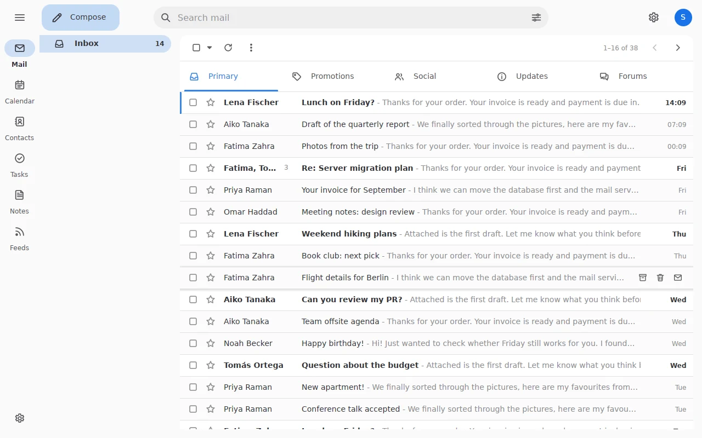
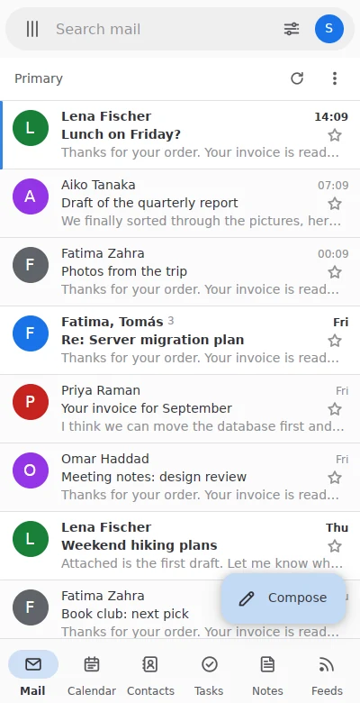

<p align="center">
  
</p>

<h1 align="center">Katna</h1>

<p align="center">
  <b>A fast, modern mail and calendar suite for Linux, written in Rust.</b><br>
  Katna Mail, Katna Calendar and a small background service, made to feel at
  home on KDE Plasma and GNOME. An alternative to KDE PIM.
</p>

<p align="center">
  <a href="https://github.com/QuakeString/katna/actions/workflows/ci.yml"></a>
  <a href="https://github.com/QuakeString/katna/releases/tag/arch-latest"></a>
  <a href="LICENSE"></a>
</p>

<p align="center">
  
</p>

> **Status: early development.** Katna Mail is usable day to day on real
> accounts, but things change fast and there are no versioned releases yet.
> A prebuilt Arch Linux package follows every change on `main`.

## Why Katna

- **Instant search.** Typo-tolerant full-text search over very large
  mailboxes: across the 517,000 messages of the Enron corpus, a query takes
  2.4 ms at the median and 9.7 ms at p99.
- **Works when the window is closed.** `katna-daemon` syncs, notifies and
  sends scheduled mail in the background, from a binary under 20 MB.
- **Feels native.** System colors and accent, tray icon with unread badge,
  KDE global menu, desktop notifications you can act on, and your KDE user
  picture as your own.
- **Local-first and private.** Your mail stays on your machine, remote
  content is blocked by default, passwords live in your keyring, and TLS is
  pure Rust (`rustls`).

## Katna Mail today

<table>
  <tr>
    <td width="50%"></td>
    <td width="50%"></td>
  </tr>
  <tr>
    <td>Reading pane with encrypted and signed mail</td>
    <td>Built-in viewer for PDFs, pictures, sheets and documents</td>
  </tr>
  <tr>
    <td></td>
    <td align="center"></td>
  </tr>
  <tr>
    <td>KDE global menu, taskbar count and tray badge</td>
    <td>The same app on a phone-sized screen</td>
  </tr>
</table>

- **Accounts:** IMAP (IDLE, QRESYNC, labels), POP3 and SMTP, with server
  autodiscovery. Gmail categories, Important and duplicate copies are
  handled. Message bodies download when you open them if they are not
  stored yet.
- **List and reader:** conversations, category tabs, stars, Important, pins,
  attachment chips, hover actions, Undo toasts, and a clean reading
  pane with HTML mail (dark mode included) and sender logos.
- **Compose:** rich text, signatures, inline reply, a pop-out window,
  scheduled send and undo send.
- **Encrypted mail:** OpenPGP and S/MIME through your own GnuPG.
- **Attachments:** previews on cards, a built-in viewer, Save all, and
  "Open with" any installed app, with a default app per file type.
- **Your desktop:** tray icon, unread badge, global menu, notifications
  with Reply all, Mark read and Archive, light and dark themes, optional
  own window frame with blur (Experimental).
- **Any screen size:** desktop, tablet and phone layouts in one app.
- **Settings** for accounts, signatures, keyboard shortcuts, default apps
  and more, plus a short onboarding for new users.
- **`katnactl`:** add accounts and drive the daemon from a terminal.

### Coming next

Katna Calendar (CalDAV, with events in the Plasma clock), Contacts, Tasks,
Notes and Feeds are planned; they already have a place in the app, marked
"coming soon". See the [implementation plan](docs/IMPLEMENTATION_PLAN.md).

## Install

### Arch Linux

CI builds a package on every push to `main` and publishes it on the
[`arch-latest`](https://github.com/QuakeString/katna/releases/tag/arch-latest)
pre-release, which is also a pacman repository. Add it to
`/etc/pacman.conf`:

```ini
[katna]
SigLevel = Optional TrustAll
Server = https://github.com/QuakeString/katna/releases/download/arch-latest
```

Then install, and start the background service now and at every login:

```sh
sudo pacman -Syu katna-git
systemctl --user enable --now katna-daemon
```

To update later:

```sh
sudo pacman -Syu
systemctl --user restart katna-daemon
```

The package is x86_64 only and not signed yet. Passwords are kept in the
Secret Service, so GNOME Keyring, KWallet or KeePassXC must be running. More
in [packaging/README.md](packaging/README.md), including building the
package yourself.

### Other distributions

Flatpak, .deb, .rpm and more are planned. Until then, build from source.

## Build from source

```sh
cargo build --workspace
cargo test --workspace
```

Rust: the latest stable, installed automatically by rustup from
`rust-toolchain.toml`. For local IMAP, SMTP and CalDAV test servers, see
[dev/README.md](dev/README.md).

## Learn more

- [Architecture](docs/ARCHITECTURE.md): what we build and why.
- [Implementation plan](docs/IMPLEMENTATION_PLAN.md): phases and progress.
- [Packaging](packaging/README.md): the Arch package and installed files.

## Built with love, on the shoulders of giants

Katna would not exist without these projects and the people behind them.

- **[Pimalaya](https://github.com/pimalaya):** the mail protocols under the
  hood. `io-imap`, `io-smtp` and `io-sasl` speak to your mail servers, on top
  of [`imap-codec`](https://github.com/duesee/imap-codec) for IMAP parsing.
- **[GPUI](https://github.com/zed-industries/zed)** from Zed: the
  GPU-accelerated UI framework that draws every pixel of Katna Mail.
- **Main crates:**
  [Tantivy](https://github.com/quickwit-oss/tantivy) (search),
  [SQLite](https://sqlite.org) via [rusqlite](https://github.com/rusqlite/rusqlite) (storage),
  [rustls](https://github.com/rustls/rustls) (TLS),
  [mail-parser](https://github.com/stalwartlabs/mail-parser) (MIME),
  [html5ever](https://github.com/servo/html5ever) (HTML mail),
  [zbus](https://github.com/z-galaxy/zbus) and [ashpd](https://github.com/bilelmoussaoui/ashpd) (D-Bus and portals),
  [oo7](https://github.com/linux-credentials/oo7) (Secret Service),
  [hayro](https://github.com/LaurenzV/hayro) and [krilla](https://github.com/LaurenzV/krilla) (PDF view and print),
  [calamine](https://github.com/tafia/calamine) (spreadsheets),
  [resvg](https://github.com/linebender/resvg) (SVG),
  [jiff](https://github.com/BurntSushi/jiff) (dates and time zones),
  [spellbook](https://github.com/helix-editor/spellbook) (spell checking) and
  [smol](https://github.com/smol-rs/smol) (async).
  Each keeps its own license (MIT, Apache-2.0, MPL-2.0 and others); see
  `Cargo.lock` for the full list.

With love for **[Rust](https://www.rust-lang.org)** 🦀, which makes a fast
and safe mail client a joy to write (Katna has no `unsafe` code), for
**[KDE](https://kde.org)**, whose Plasma desktop and PIM suite inspired
Katna, and for **[Linux](https://kernel.org)** and the free software
community that builds it. 🐧

## Support and follow

Katna is free software, built in the open.

- ⭐ Star the repository and [report issues](https://github.com/QuakeString/katna/issues).
- ☕ Buy me a coffee on Patreon: link coming soon.
- Follow the author, Mozammel: [GitHub](https://github.com/QuakeString).
  X and LinkedIn links are coming soon.

<!-- TODO: Patreon, X and LinkedIn URLs, when Mozammel shares them. -->

## License

Katna is licensed under the GNU General Public License, version 3 or later
(GPL-3.0-or-later). See [LICENSE](LICENSE).
