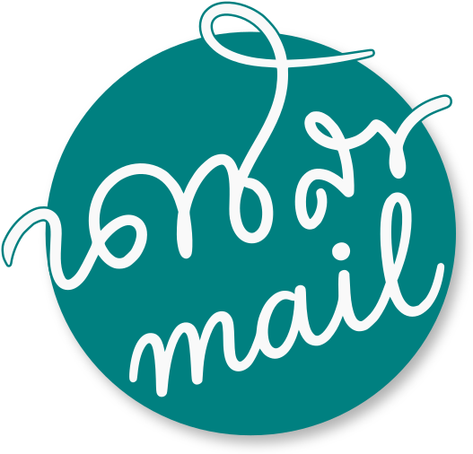
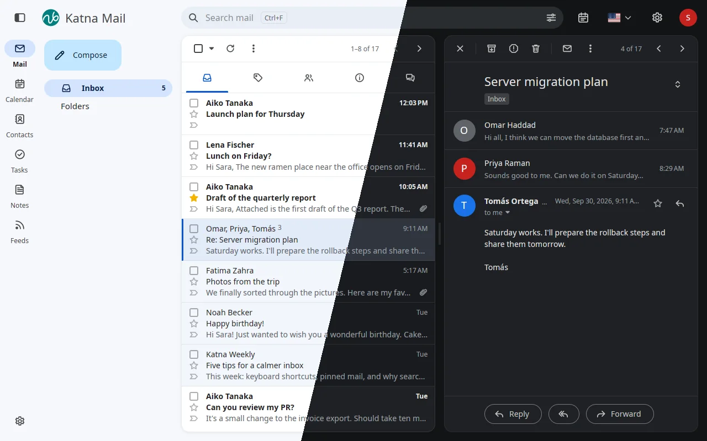
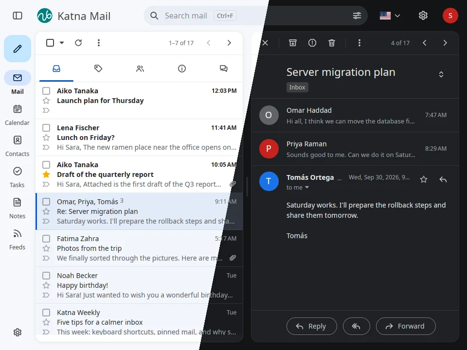
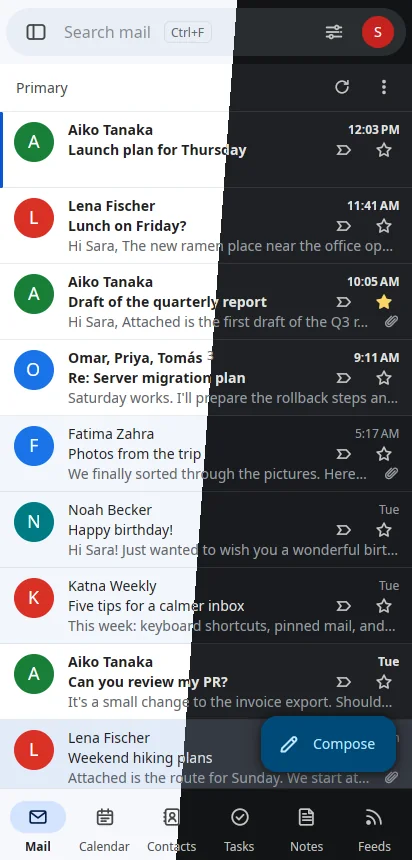
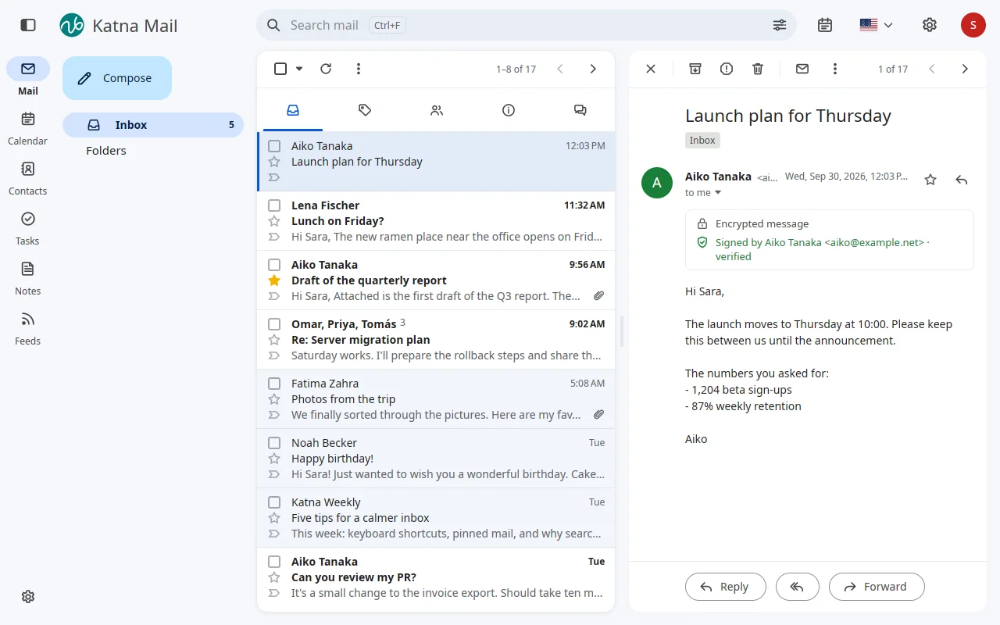
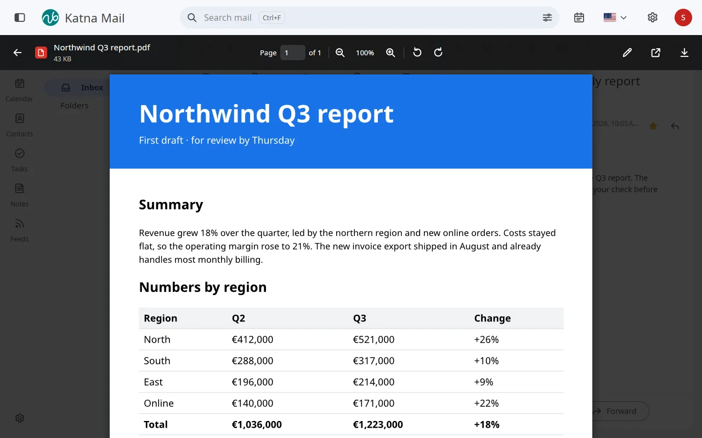
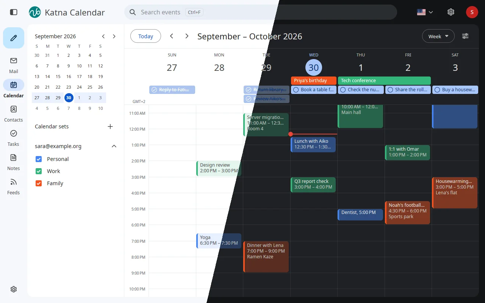
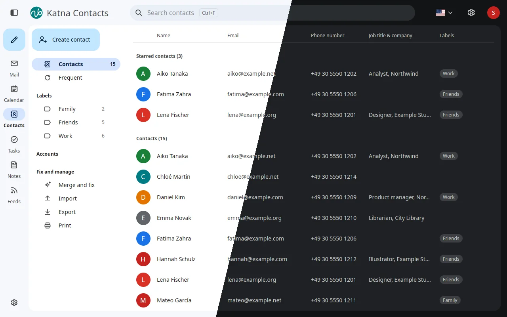
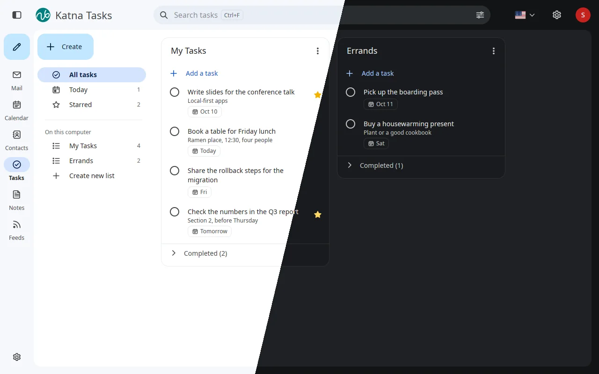
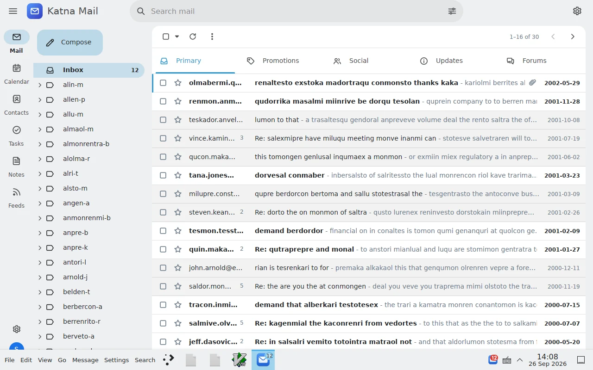

<p align="center">
  
</p>

<h1 align="center">Katna</h1>

<p align="center">
  <b>A fast, modern mail and calendar suite for Linux, written in Rust.</b><br>
  Katna Mail, Katna Calendar and a small background service, made to feel at
  home on KDE Plasma and GNOME. An alternative to KDE PIM.
</p>

> [!WARNING]
> **Katna is at a very early stage of development. Please do not use it in
> production, or for any mail you cannot afford to lose.**
> It changes every day and will break often; an update can undo what worked
> the day before. There are no versioned releases yet. If you try it anyway,
> use it with great caution, on an account you can spare, and keep your own
> backups.

<p align="center">
  <a href="https://github.com/QuakeString/katna/actions/workflows/ci.yml"></a>
  <a href="https://github.com/QuakeString/katna/releases/tag/arch-latest"></a>
  <a href="LICENSE"></a>
</p>

<p align="center">
  <a href="https://buymeacoffee.com/quakestring"></a>
  <a href="https://x.com/QuakeString"></a>
  <a href="https://www.linkedin.com/in/md-mozammel-hossain-97a20446/"></a>
</p>

<p align="center">
  
</p>

## Why I built Katna

For about ten years, KMail was the mail app I loved most. It looked
native on my desktop and I could shape it exactly the way I wanted. But it
kept breaking for me, and it still does today. I tried Thunderbird, but
its mail search never found what I was looking for. Then I tried
Mailspring, which looks lovely and works well, but it never fitted into
KDE and it is very large.

What I really love is Gmail: its interface and how easy it is to use. I
just don't want my mail to live in a web page; I want a desktop app that
also works offline. No app gave me all of that, so I set out to build one.

Katna Mail is not trying to be unique or revolutionary. It is a very
personal project: the mail client I wanted on my own Linux desktop. Its
features and look are openly borrowed from the mail apps I love, mainly
Gmail, Mailspring and Thunderbird, and rebuilt in Rust with Katna's own
name and icons. KMail, Thunderbird and Mailspring are made by people who
have given a lot to free software, and Katna owes each of them a great
deal.

Katna has only been possible because of how far LLMs (large language
models) have come. They turned a full mail client, long the work of a whole
team, into something one person can build with care. I still design every
screen, check it pixel by pixel and use Katna every day, on a real desktop
with real mail.

— Mozammel

## Highlights

- **Instant search.** Typo-tolerant full-text search over very large
  mailboxes: across the 517,000 messages of the Enron corpus, a query takes
  2.4 ms at the median and 9.7 ms at p99.
- **Works when the window is closed.** `katna-daemon` syncs, notifies and
  sends scheduled mail in the background, from a small binary.
- **Feels native.** System colors and accent, tray icon with unread badge,
  KDE global menu, desktop notifications you can act on, and your KDE user
  picture as your own.
- **Local-first and private.** Your mail stays on your machine, remote
  content is blocked by default, passwords live in your keyring, and TLS is
  pure Rust (`rustls`).

## Katna Mail today

One window for mail, calendar, contacts, tasks and notes, on every screen
size, in light and dark. Desktop is shown above; the rest below. Every
screenshot uses made-up demo data.

<table>
  <tr>
    <td width="68%"></td>
    <td width="32%" align="center"></td>
  </tr>
  <tr>
    <td>Tablet: list and conversation side by side</td>
    <td>Phone: laid out like a phone app</td>
  </tr>
  <tr>
    <td width="50%"></td>
    <td width="50%"></td>
  </tr>
  <tr>
    <td>Encrypted and signed mail</td>
    <td>Built-in viewer for PDFs, pictures, sheets and documents</td>
  </tr>
  <tr>
    <td colspan="2" align="center"></td>
  </tr>
  <tr>
    <td colspan="2" align="center">Calendar: your week, with calendars grouped by account and tasks on their day</td>
  </tr>
  <tr>
    <td width="50%"></td>
    <td width="50%"></td>
  </tr>
  <tr>
    <td>Contacts, with labels and starred people</td>
    <td>Tasks, in lists with due dates and stars</td>
  </tr>
  <tr>
    <td colspan="2" align="center"></td>
  </tr>
  <tr>
    <td colspan="2" align="center">KDE global menu, taskbar count and tray badge</td>
  </tr>
</table>

- **Accounts:** IMAP (IDLE, QRESYNC, labels), POP3 and SMTP, with server
  autodiscovery. Gmail categories, Important and duplicate copies are
  handled. Message bodies download when you open them if they are not
  stored yet.
- **List and reader:** conversations, category tabs, stars, Important, pins,
  attachment chips, hover actions, Undo toasts, and a clean reading
  pane with HTML mail (dark mode included) and sender logos.
- **Compose:** rich text, signatures, inline reply, a pop-out window,
  scheduled send and undo send.
- **Encrypted mail:** OpenPGP and S/MIME through your own GnuPG.
- **Attachments:** previews on cards, a built-in viewer, Save all, and
  "Open with" any installed app, with a default app per file type.
- **Your desktop:** tray icon, unread badge, global menu, notifications
  with Reply all, Mark read and Archive, light and dark themes, optional
  own window frame with blur (Experimental).
- **Calendar:** day, week, month and year views, events from Google,
  Microsoft and CalDAV accounts or on this computer, repeating events,
  invitations answered from the reader, and events in the Plasma clock.
- **Contacts:** synced from Google, Microsoft and CardDAV, with labels,
  birthdays in the calendar, merge and fix, import, export and print.
- **Tasks:** Google Tasks, Microsoft To Do and CalDAV lists, with due
  dates, reminders, repeats and stars.
- **Notes:** notes in Google Keep's look, kept in each account's Notes
  folder so they also show in Apple Notes and Thunderbird.
- **Any screen size:** desktop, tablet and phone layouts in one app.
- **Settings** for accounts, signatures, keyboard shortcuts, default apps
  and more, plus a short onboarding for new users.
- **`katnactl`:** add accounts and drive the daemon from a terminal.

### Coming next

See the [implementation plan](docs/IMPLEMENTATION_PLAN.md).

## Install

### Arch Linux

Please read the warning at the top of this page first: Katna is not ready
for everyday use yet.

CI builds a package on every push to `main` and publishes it on the
[`arch-latest`](https://github.com/QuakeString/katna/releases/tag/arch-latest)
pre-release, which is also a pacman repository. Add it to
`/etc/pacman.conf`:

```ini
[katna]
SigLevel = Optional TrustAll
Server = https://github.com/QuakeString/katna/releases/download/arch-latest
```

Then install:

```sh
sudo pacman -Syu katna-git
```

Open Katna Mail once. From then on Katna starts at every login, quietly:
mail syncs and new-mail notifications and the tray icon come up without
the window (Settings > General > Desktop turns that off).

To update later:

```sh
sudo pacman -Syu
systemctl --user restart katna-daemon
```

The package is x86_64 only and not signed yet. Passwords are kept in the
Secret Service, so GNOME Keyring, KWallet or KeePassXC must be running. More
in [packaging/README.md](packaging/README.md), including building the
package yourself.

### Other distributions

Flatpak, .deb, .rpm and more are planned. Until then, build from source.

## Build from source

```sh
cargo build --workspace
cargo test --workspace
```

Rust: the latest stable, installed automatically by rustup from
`rust-toolchain.toml`. For local IMAP, SMTP and CalDAV test servers, see
[dev/README.md](dev/README.md).

## Learn more

- [Architecture](docs/ARCHITECTURE.md): what we build and why.
- [Implementation plan](docs/IMPLEMENTATION_PLAN.md): phases and progress.
- [Packaging](packaging/README.md): the Arch package and installed files.

## Built with love, on the shoulders of giants

Katna would not exist without these projects and the people behind them.

- **[GPUI](https://github.com/zed-industries/zed/tree/main/crates/gpui) and
  the [Zed](https://zed.dev) project:** Katna Mail's whole interface is built
  on GPUI, the fast, GPU-accelerated UI framework that Zed Industries made
  for the [Zed editor](https://github.com/zed-industries/zed). Every pixel,
  animation and window you see is drawn by it. Thank you, Zed team, for
  building it in the open.
- **[Pimalaya](https://github.com/pimalaya):** the mail protocols under the
  hood. `io-imap`, `io-smtp` and `io-sasl` speak to your mail servers, on top
  of [`imap-codec`](https://github.com/duesee/imap-codec) for IMAP parsing.
- **Main crates:**
  [Tantivy](https://github.com/quickwit-oss/tantivy) (search),
  [rusqlite](https://github.com/rusqlite/rusqlite) (storage),
  [futures-rustls](https://github.com/quininer/futures-rustls) (TLS),
  [mail-parser](https://github.com/stalwartlabs/mail-parser) (MIME),
  [html5ever](https://github.com/servo/html5ever) (HTML mail),
  [zbus](https://github.com/z-galaxy/zbus) and [ashpd](https://github.com/bilelmoussaoui/ashpd) (D-Bus and portals),
  [oo7](https://github.com/linux-credentials/oo7) (Secret Service),
  [hayro](https://github.com/LaurenzV/hayro) and [krilla](https://github.com/LaurenzV/krilla) (PDF view and print),
  [calamine](https://github.com/tafia/calamine) (spreadsheets),
  [resvg](https://github.com/linebender/resvg) (SVG),
  [jiff](https://github.com/BurntSushi/jiff) (dates and time zones),
  [spellbook](https://github.com/helix-editor/spellbook) (spell checking) and
  [smol](https://github.com/smol-rs/smol) (async).
  Under them, [SQLite](https://sqlite.org) stores your mail and
  [rustls](https://github.com/rustls/rustls) keeps your connections safe.
- **Color schemes:** the built-in schemes take their palettes from
  [Nord](https://www.nordtheme.com), [Solarized](https://ethanschoonover.com/solarized/),
  [Dracula](https://draculatheme.com), [Gruvbox](https://github.com/morhetz/gruvbox),
  [Catppuccin](https://catppuccin.com), [Tokyo Night](https://github.com/folke/tokyonight.nvim),
  [One](https://github.com/atom/atom/tree/master/packages/one-dark-ui),
  [Rosé Pine](https://rosepinetheme.com), [Everforest](https://github.com/sainnhe/everforest),
  [Kanagawa](https://github.com/rebelot/kanagawa.nvim) and [Ayu](https://github.com/ayu-theme/ayu-colors),
  all MIT-licensed. Clear follows Apple's system colors.

**[CREDITS.md](CREDITS.md) lists every library Katna uses, with its
authors, license and link.** It is generated from `Cargo.lock` by
`ci/gen-credits.sh`, together with [`docs/credits.json`](docs/credits.json)
for the app's About dialog.

With love for **[Rust](https://www.rust-lang.org)** 🦀, which makes a fast
and safe mail client a joy to write (Katna has no `unsafe` code), for
**[KDE](https://kde.org)**, whose Plasma desktop and PIM suite inspired
Katna, and for **[Linux](https://kernel.org)** and the free software
community that builds it. 🐧

💙 **Support KDE.** KDE builds the desktop Katna feels most at home on, and
it is made by volunteers and funded by people like you. If you enjoy Plasma
or KDE's apps, please consider
[donating to KDE](https://kde.org/donate/).

## Support and follow

Katna is free software, built in the open. If it helps you, a coffee keeps
it going.

<p>
  <a href="https://buymeacoffee.com/quakestring"></a>
</p>

- ⭐ Star [the repository](https://github.com/QuakeString/katna) and
  [report issues](https://github.com/QuakeString/katna/issues).
- Follow the author, Mozammel:
  [GitHub](https://github.com/QuakeString) ·
  [X](https://x.com/QuakeString) ·
  [LinkedIn](https://www.linkedin.com/in/md-mozammel-hossain-97a20446/)

## License

Katna is licensed under the GNU General Public License, version 3 or later
(GPL-3.0-or-later). See [LICENSE](LICENSE).
