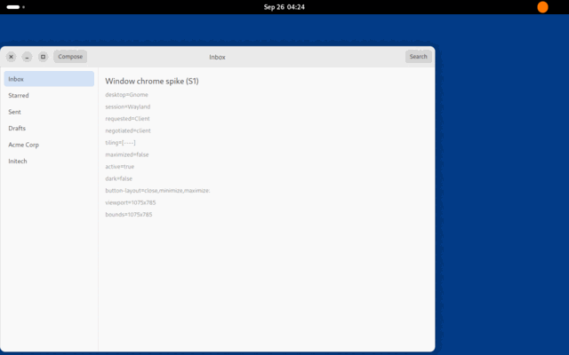
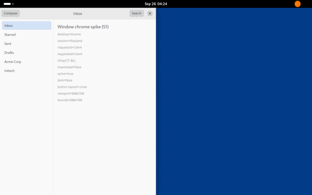
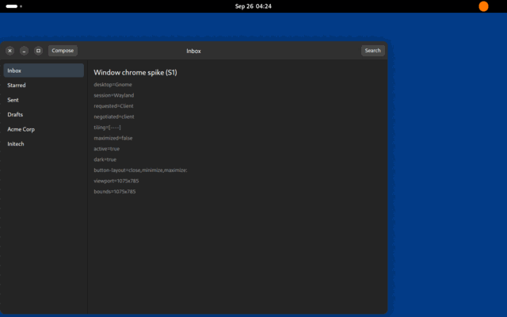
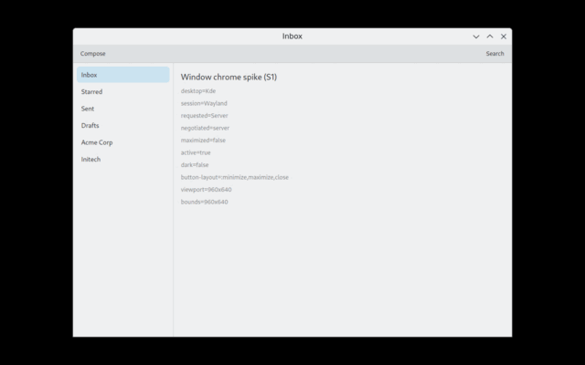
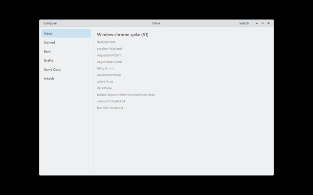

# Spike S1 — Window chrome

**Question:** can GPUI give us native-looking window frames on KDE and GNOME?
(`IMPLEMENTATION_PLAN.md` §4)

**Answer: yes.** `gpui-pre` 0.3.6 exposes everything the plan asks for:
xdg-decoration negotiation, tiling state, window geometry insets, input
regions, compositor move/resize/window menu, and the GNOME `button-layout`
(with live updates). KWin gives us real Breeze server-side decorations;
on GNOME our own header bar, shadow, rounded corners and resize edges work.
We keep GPUI for the UI and take this design into task 3.2.

Two findings change other parts of the plan: the GPUI binary size (§17 of
the architecture) and GPUI's build dependencies (CI). See "Findings".

## What was built

`crates/katna-chrome` (kept, not throw-away: it is the start of task 3.2):

| Module | GPUI? | What it does |
|---|---|---|
| `desktop` | no | Detects the desktop (`XDG_CURRENT_DESKTOP`) and session, picks the decoration mode and preset. Override: `KATNA_DECORATIONS=auto\|server\|client` (stands in for the user setting). |
| `geometry` | no | CSD frame geometry: frame rect inside the surface, input region, resize-edge hit test. GTK 4 numbers: 12 px resize band outside the frame, corner handles reach 24 px along each edge. |
| `tokens` | no | Theme tokens with Adwaita-like and Breeze-like presets, light and dark. |
| `frame` | yes | `window_options()` and `WindowChrome`: toolbar under SSD; header bar, window buttons, layered shadow, rounded corners, resize edges and input region under CSD. |

Try it:

```sh
cargo run -p katna-chrome --example chrome-spike
KATNA_DECORATIONS=client cargo run -p katna-chrome --example chrome-spike
```

The example is a Katna Mail-shaped window that shows (and prints to stderr)
the detected desktop, requested and negotiated decorations, tiling state,
focus, color scheme and button layout.

Decision logic (unchanged from architecture §13.1):

| Session | Desktop | Requested | Look |
|---|---|---|---|
| Wayland | KDE | server (KWin draws Breeze) | Breeze-like toolbar below the title bar |
| Wayland | GNOME | client | Adwaita-like header bar, 48 px shadow margin |
| Wayland | other | server; GPUI falls back to client if the compositor has no xdg-decoration | minimal frame (1 px border, no shadow, 12 px resize band); none when fully tiled |
| X11 | any | server (`_MOTIF_WM_HINTS`) | toolbar |

## How it was tested

No real desktop was available, so the spike ran against the real
compositors, headless, in the CI-like sandbox (Ubuntu 24.04):

- **GNOME Shell 46.0 / Mutter 46.2**, `gnome-shell --headless --virtual-monitor`,
  with the Settings portal (`xdg-desktop-portal-gnome`). Pointer and keyboard
  were driven through Mutter's RemoteDesktop D-Bus API, window state read and
  screenshots taken through `org.gnome.Shell.Eval` / `Screenshot`
  (unsafe mode).
- **KWin 5.27.11** (Plasma 5), `kwin_wayland --virtual` with the Breeze
  decoration; maximize/tile via KWin scripting; screenshots with Spectacle.
- **X11**: Xvfb (no window manager), window properties with `xprop`.
- Rendering: Mesa lavapipe (software Vulkan) through wgpu.

## Results

| Success criterion | Result |
|---|---|
| KWin server-side decorations on Plasma | ✅ xdg-decoration negotiates `server_side`; KWin draws the Breeze title bar and buttons; our toolbar sits below it. Maximize and quick-tile work. |
| GNOME client-side header bar | ✅ Mutter offers no xdg-decoration, GPUI reports client-side; header bar with centered bold title, `start`/`end` widgets and window buttons. |
| Shadow | ✅ Three-layer libadwaita-style shadow in a 48 px transparent margin; `set_window_geometry` excludes it (Mutter reports the frame rect, e.g. 960×640 for a 1056×736 surface). Smaller shadow when unfocused (measured falloff ≈ 50 px focused, ≈ 15 px unfocused). |
| Rounded corners | ✅ 12 px when floating; square on tiled sides; none when maximized. |
| Correct `button-layout` | ✅ Read through the Settings portal and **updated live**: `appmenu:close` → close only; `close,minimize,maximize:` → buttons on the left; default Ubuntu `…:minimize,maximize,close`. Unknown entries (`appmenu`) are ignored. |
| Resize edges | ✅ Right edge, bottom-right corner and top-left corner (24 px along the edge) resize through `xdg_toplevel.resize`; a click 30 px out in the shadow passes through to the desktop (input region). |
| Tiling behavior | ✅ Super+Left on GNOME and quick-tile on KWin: tiling `[T-BL]` → no margin, no rounding, no resize on tiled sides; shadow kept on the free side. Maximized = all sides tiled. |
| Header bar interactions | ✅ Drag moves the window (also un-maximizes); double-click toggles maximize; right-click opens the compositor's window menu; close button closes. |
| Dark mode | ✅ `color-scheme prefer-dark` switches the tokens live. |
| X11 | ✅ `_MOTIF_WM_HINTS` requests WM decorations; `WM_CLASS` is `in.invenia.katna.Mail`. |
| KDE with CSD forced | ✅ Breeze-like header bar under KWin (`KATNA_DECORATIONS=client`), tiling included. |

Screenshots (headless, software rendering, half size):

| GNOME, buttons on the left | GNOME, tiled left | GNOME, dark |
|---|---|---|
|  |  |  |

| KWin 5.27, Breeze SSD | KWin, CSD forced |
|---|---|
|  |  |

## Findings

1. **Binary size.** The spike example (GPUI with its Wayland and X11
   backends, release profile) is **21.5 MB** (6.2 MB xz). The 8.4 MB
   "hello world" in architecture §17.1 was most likely built without the
   `wayland`/`x11` features of `gpui-pre-platform`: without them the
   binary contains no Linux backend and panics at start ("At least one of
   the wayland or x11 features must be enabled"). HELLO_WORLD_RESULT
   The 30 MB budget for Katna Mail is tight; architecture §17 is updated.
2. **Build and runtime dependencies.** With the Linux backends GPUI links
   `libxkbcommon`, `libxkbcommon-x11` and `libxcb` (not only `libc`). The
   build needs `libxkbcommon-dev` and `libxkbcommon-x11-dev` (Arch:
   `libxkbcommon`, `libxkbcommon-x11`); CI installs them.
3. **cargo-deny.** GPUI brings three unmaintained crates (`paste`,
   `rustybuzz`, `ttf-parser`; no vulnerabilities) and the `bzip2-1.0.6`
   license (permissive). `deny.toml` ignores those advisories with a reason
   and allows the license; GPUI's own platform crates are listed as
   wrappers of `gpui-pre`, and `gpui-pre-platform` is banned outside the UI
   crates.
4. **Focus comes from the keyboard.** GPUI marks a window active on
   `wl_keyboard.enter`, not on the `xdg_toplevel` `activated` state. On a
   seat without a keyboard the window always looks unfocused. Real
   desktops are fine; worth an upstream fix.
5. **Portal fallback.** If the Settings portal is missing, GPUI falls back
   to `minimize,maximize,close` on the right, not GNOME's default (close
   only). `katna-platform` (task 3.3) should read the setting itself when
   the portal is unavailable.
6. **Titlebar actions are fixed.** GPUI's double-click interval is a
   constant 400 ms, and we hard-code double-click = toggle maximize and
   right-click = window menu. GNOME's `action-double-click-titlebar` /
   `action-middle-click-titlebar` and KDE's equivalents are not read yet.
7. **GPUI gotcha:** stopping propagation of mouse-down on a window button
   also cancels its click; stop mouse-move instead (as Zed does).
8. **Colors.** The Breeze titlebar color differs between Plasma 5.27
   (`#eff0f1`) and Plasma 6 (`#dee0e2`), so the toolbar must take its color
   from `kdeglobals` (task 3.3) to blend with KWin's title bar.

## Not verified here (needs a real desktop)

- **Plasma 6** KWin (only 5.27 was available) and GNOME 47/48.
- Real GPU rendering and HiDPI / fractional scaling (only lavapipe at scale 1).
- The feel with a real mouse and touchpad: cursor shapes over the resize
  edges, drag thresholds, touch. The headless virtual pointer dropped some
  button events (a harness issue: the events never reached the client), so
  each check was retried; with the final code every check passed at least
  once, and every failure traced to input that never reached the window.
- X11 with a real window manager (Xvfb had none), and CSD on X11.
- Other compositors (Sway, Hyprland): the minimal CSD path was not run.
- Idle CPU and memory cost of the transparent shadow margin.

## Next steps (task 3.2)

- Move `WindowChrome` behind a `katna-ui` component once `katna-ui` exists.
- Feed tokens from `katna-platform` (portal accent, `kdeglobals`, fonts).
- Read titlebar actions from GSettings / `kwinrc`.
- Screenshot tests for both presets (plan §7).
- Re-measure binary size with GPUI Kit before Phase 3.
